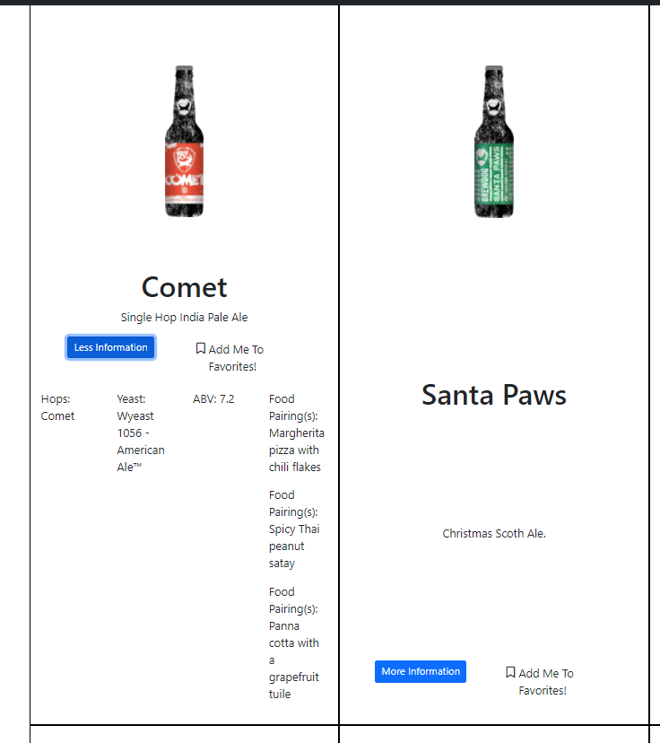
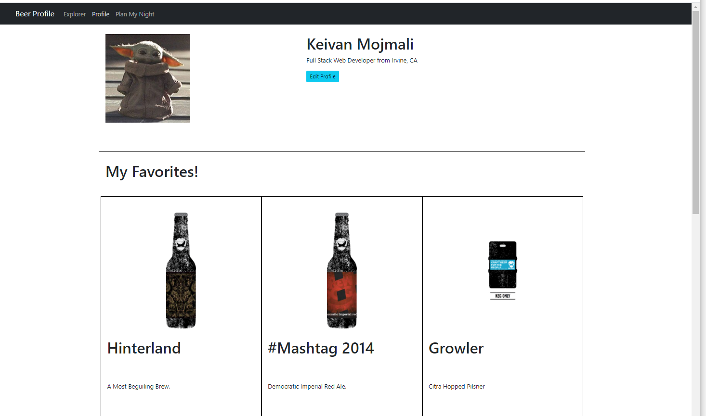
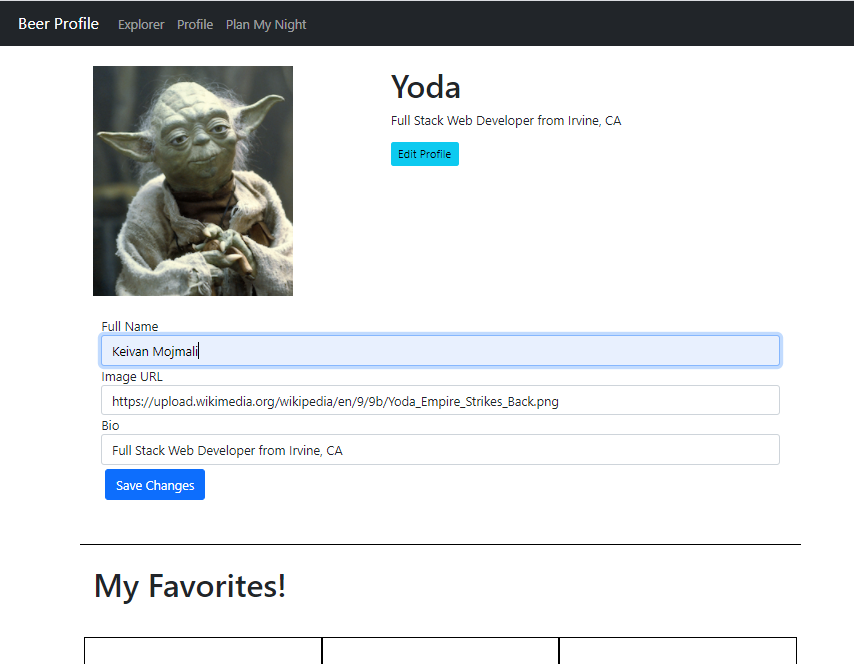
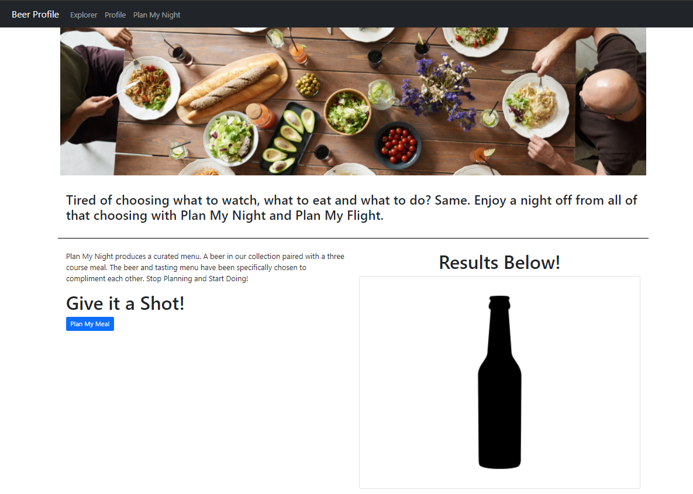
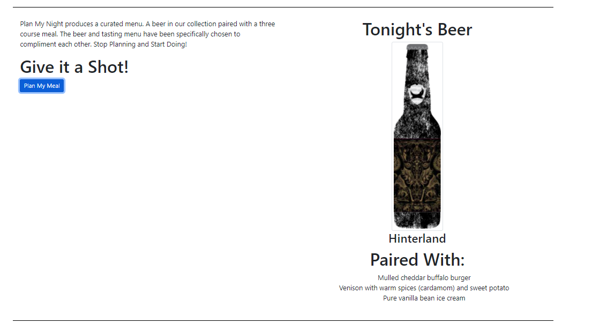
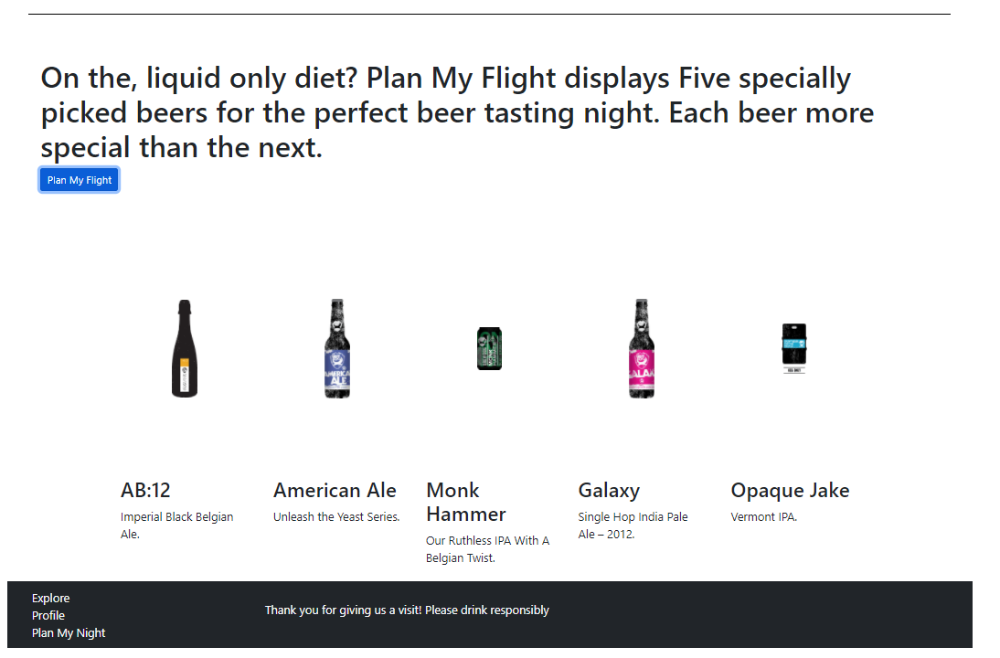
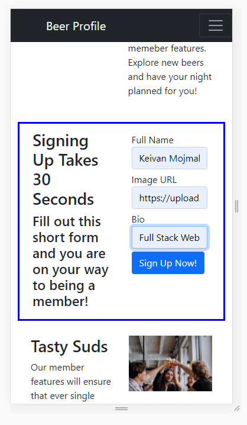
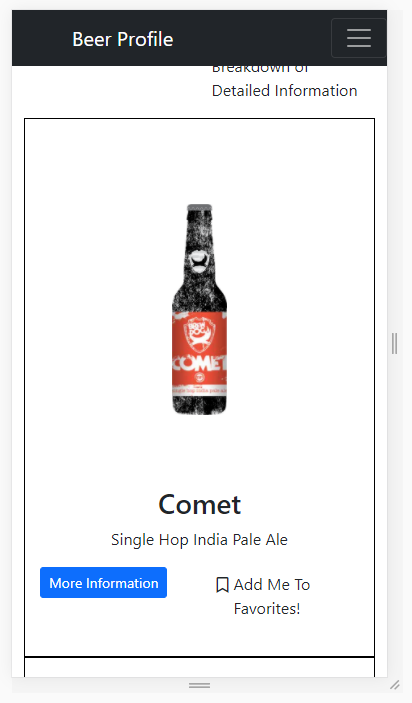
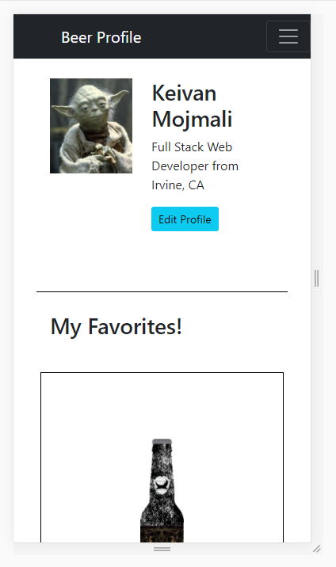
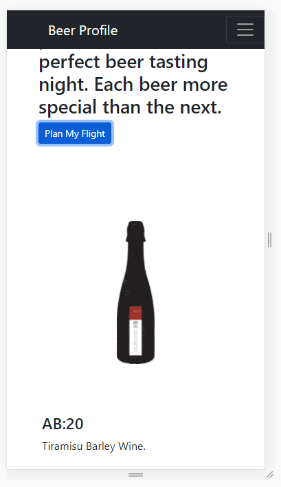

# ajax-project

A dynamic HTML, CSS, and JavaScript solo project.

**Beer Profile is a sign of the times. As more weekend nights are spent inside, America turns to craft alcohol and home cooked meals. Beer Profile helps you explore craft beers of all varieties. Also, provides you with features that takes the stress out of deciding what to drink and what foods would pair nicely with your alcohol. Beer Profile even offers a specially curated five-beer flight sampler.** 

### Live demo of Beer Profile can been seen at the link below:
https://keivanmojmali.github.io/ajax-project/ 

### Beer Profile offers the following features: 
* Users are able to create a profile 
* Users are able to explore craft beers on explorer page
* Users are able to save beers to favorites list on profile
* Users can save detailed notes about each favorited beer in their profile
* Users can have a random five-beer flight curated for them
* Users can have a randomly picked beer and a three-course meal that pairs with that beer, curated for them 

### Planned additions
* Ability to purchase beer from a third-party source, directly on Beer Profile
  * Ability to pay with Apple Pay, Amazon Pay or similar hassle-free electronic payment
* Ability to locate closest in-person retailer that carries chosen craft beer 
* Beer Journal feature
  * Store notes and experiences on craft beers
  * Upload pictures 
  * Share journal entries through social media accounts 
  
### Main takeway from Beer Profile
* To prototype design but also pre-plan functions. Beer Profile was written using functional programming paradigm. 
Looking back, I can see that I could have planned pure functions from the start which would have dictated which features to
work on first. This would save me time on building out the code but also on debugging. 

### Screenshots 

### Initial landing page - user does not have a profile

### Beer explorer page - once user has created a profile

### View detailed information and add to favorites list from explorer page

### View profile and saved favorites

### Edit profile and change stored information 

### Plan My Night page - showing main top portion and beer pairing feature

### Beer pairing result with three course meal 

### Five-beer curated flight option results

## Mobile Screenshots

